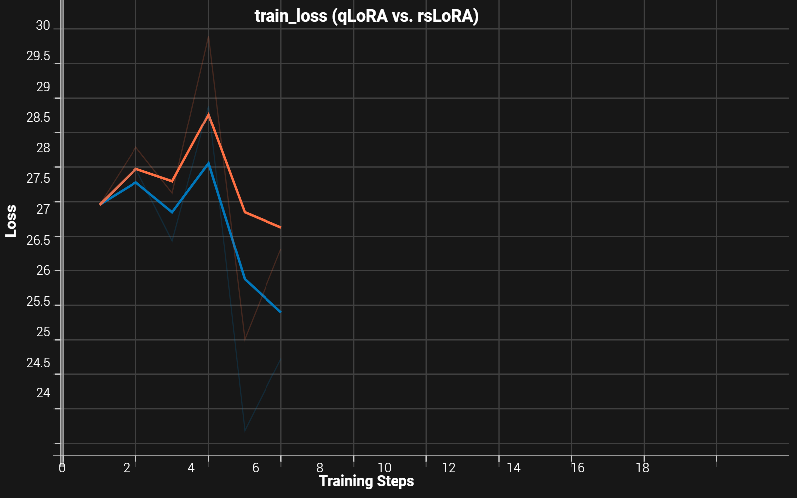
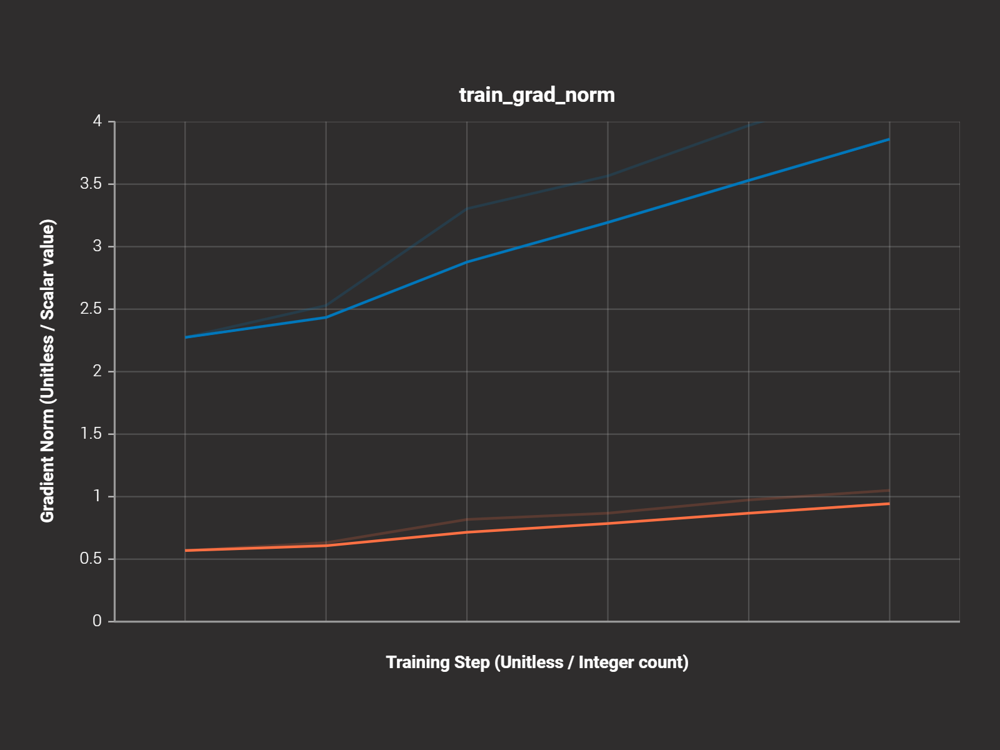
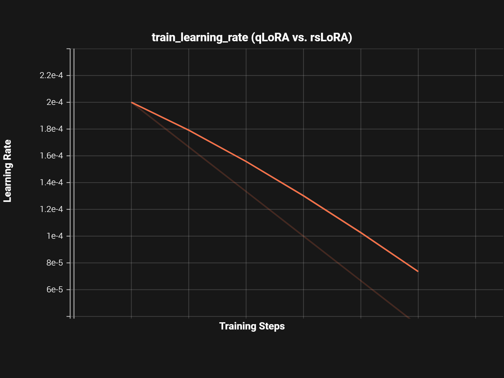

#  Engineering Milestones & Architectural Improvements

This document outlines the specific mathematical optimizations, hardware efficiency milestones, and training telemetry insights that yielded a higher-quality fine-tuning run compared to standard baseline configurations.

---

## 1. Mathematical Scaling Optimization (rsLoRA vs. QLoRA)

The primary improvement in this project was replacing the standard low-rank adaptation matrix scaling with Rank-Stabilized LoRA (rsLoRA). This directly solved the learning stagnation common when tuning small, specialized datasets.

### The Numerical Multiplier Shift
* **Standard QLoRA Scaling Matrix:** $\frac{\alpha}{r} = \frac{16}{16} = \mathbf{1.0}$
* **Implemented rsLoRA Scaling Matrix:** $\frac{\alpha}{\sqrt{r}} = \frac{16}{\sqrt{16}} = \mathbf{4.0}$

By modifying the scaling denominator to a square root factor, the effective update magnitude of the adapter weights relative to the base model was increased by **400% ($4\times$)**. This adjustment provided the necessary mathematical momentum to calculate deeper weight updates without destabilizing the foundation parameters.

### Telemetry Performance Visualizations

#### A. Loss Convergence Depth
The model effectively negotiated structural template formatting tokens before achieving a definitive breakthrough at Step 4. Empowered by rank stabilization, **rsLoRA (Blue Line)** maintained a steeper optimization trajectory past this hurdle, descending to a significantly lower final cross-entropy loss value by Step 6 compared to the conservative baseline of standard QLoRA (Orange Line).

#### B. Gradient Dynamics & Trajectory Strength
The impact of the $4\times$ scaling multiplier is directly verified by the gradient norm telemetry. Standard QLoRA stagnated in a flat, inactive trajectory. In contrast, rsLoRA demonstrated an active, steadily climbing gradient norm, indicating robust backpropagation activity and continuous parameter optimization throughout the training cycle.

#### C. Controlled Velocity Scheduler
To ensure an objective apples-to-apples architectural comparison, both training configurations were bound to an identical linear decay learning rate scheduler. Dropping smoothly from a peak of $2 \times 10^{-4}$ down towards zero, this scheduler provided bold optimization steps early on, followed by fine-grained adjustments at the final steps to prevent the weights from overshooting local minima.

---

## 2. Systems Engineering & Hardware Containment

Executing a 2.6-Billion parameter language model fine-tuning loop on an entry-level **NVIDIA RTX 3050 4GB Laptop GPU** under Windows requires aggressive memory management. This pipeline implemented three critical system-level improvements to compress execution requirements:

| Optimization Vector | Technical Mechanism | VRAM Impact |
| :--- | :--- | :--- |
| **Quantized NF4 Base** | Compresses base model weights into 4-bit NormalFloat quantiles. | Saves **~75%** of foundational base memory. |
| **8-bit Optimizer States** | Swaps out traditional 32-bit states for `adamw_8bit` parameter tracking. | Lowers optimization calculation memory by **75%**. |
| **Gradient Checkpointing** | Clears intermediate activation tensors, calculating them on-the-fly during backpropagation. | Drops active activation memory requirements to a flat, non-scaling baseline. |

### The Ultimate Engineering Outcome
Through these coordinated structural constraints, the model's active footprint was locked between **~1.8 GB and 2.2 GB of VRAM**. This left nearly **50% of the 4.0 GB physical frame buffer completely free**, preventing system out-of-memory errors and avoiding slow system memory offloading.
